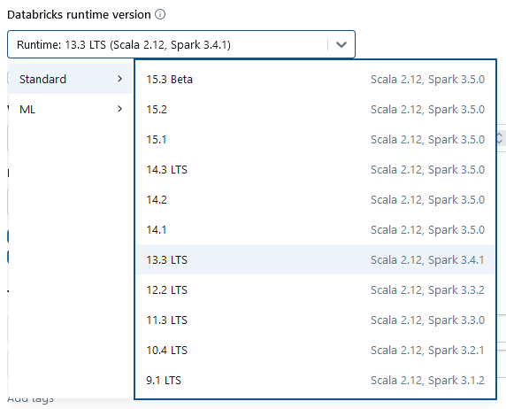
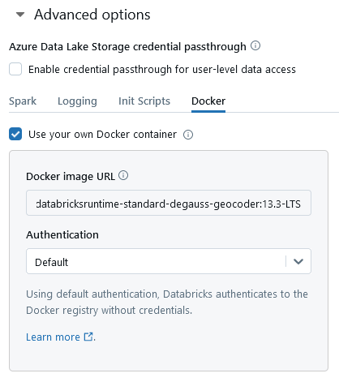

# About

Extensions of [databricksruntime/minimal](https://github.com/databricks/containers/tree/master/ubuntu/minimal)

# Usage

Edit your cluster configuration to use a standard (i.e., non-ML) Databricks Runtime Version that matches the tag of your desired Docker image URL. Then supply the Docker image URL under Advanced options. For example:

## Set Databricks Runtime Version

Databricks Runtime Version: 13.3 LTS (includes Apache Spark 3.4.1, Scala 2.12)

## Supply Docker image URL

Docker image URL: themadstatter/databricksruntime-standard-degauss-geocoder:13.3-LTS

